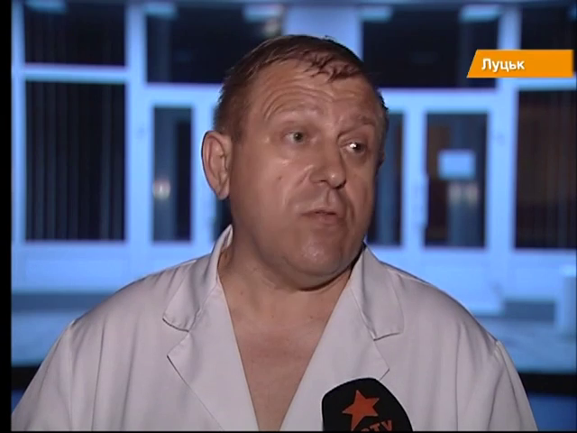
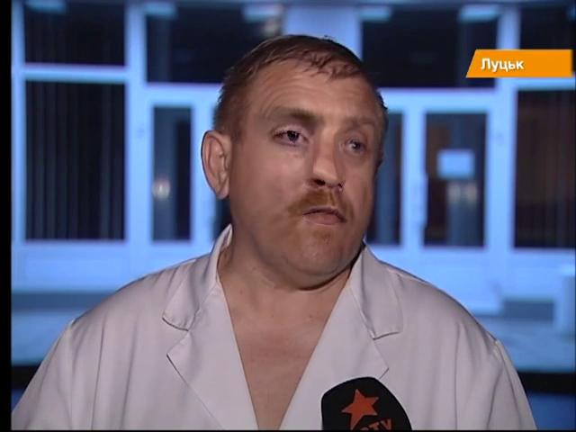

# Summary-of-my-research-in-Deepfake-Detection
## 🐋 Personal Introduction
```
Caibo Feng, Mar 2025
gn001_888@163.com; CaiBoFengEXIA@outlook.com
```
Maybe I won, maybe I failed. Whatever, I can only keep going.㊗️
I am currently a master student, whose research interest focuses on Deepfake Detection.
I am seeking opportunities of work. If you are interested in my work, please feel free to contact me.🤝

## 👀 Overview of Content
- [Task brief](#intro)
- [Existing problem](#problem)
- [Future work](#future)
- [Value for society and buisness](#value)

---

<a id="intro"></a>
## 1. Task brief
Deepfake techniques bring a significant risk to face recognition system, but existing deepfake detection methods are often overfitted to the specific forgery patterns from the training samples, and thus perform poorly on unseen samples.

| Real Face                    | Fake Face                    |
|-------------------------------|-------------------------------|
|   |    |

<a id="problem"></a>
## 2. Existing problem
这里是简介内容。

<a id="future"></a>
## 3. Future work
这里是简介内容。

<a id="value"></a>
## 4. Value for society and buisness
这里是简介内容。

